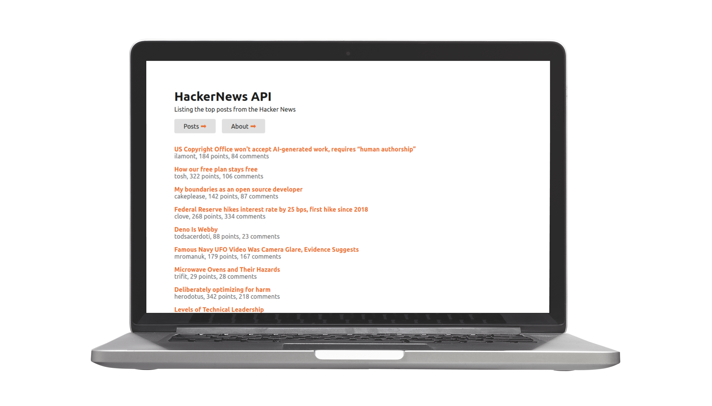

  <h1>Hacker News</h1>
  
An application that consumes the Hacker News API.

### Technologies

- [CSS Modules](https://github.com/css-modules/css-modules)
- [JavaScript](https://developer.mozilla.org/en-US/docs/Web/JavaScript)
- [React.js](https://reactjs.org/)
- [Jest](https://jestjs.io/)
- [Fetch API](https://developer.mozilla.org/pt-BR/docs/Web/API/Fetch_API)
- [Vercel](https://vercel.com/)

### Deploys

This project uses Vercel as the CI/CD platform.

You can see a live version [deployed on Vercel](https://hackernews-joziasmartini.vercel.app/).

### Running

- Install dependencies with `npm install`
- Serve for development with `npm run start`
- Compile for production with `npm run build`
- Test application with `npm run test`
